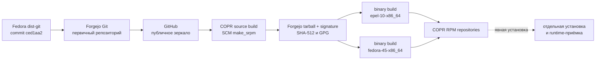

# Архитектура упаковки

## Назначение

`forgejo-pam` переносит небольшую PAM-дельту на Fedora Forgejo dist-git и
публикует отдельные RPM через COPR. Репозиторий не является fork исходного кода
Forgejo и не управляет работающим сервером.

## Поток исходников и сборки

## Границы доверия

1. Git хранит spec, Fedora sources metadata и локальную дельту. Tarball Forgejo
   в Git не хранится.
2. Source build получает tarball и подпись по сети. `.copr/Makefile` проверяет
   SHA-512 из `sources`; RPM `%prep` проверяет подпись Forgejo.
3. Binary build выполняется без сети в отдельном COPR chroot.
4. COPR подписывает опубликованный RPM ключом проекта.
5. Установка RPM изменяет локальный хост и требует отдельного разрешения,
   резервной копии и проверки.

CodeQL анализирует только GitHub Actions workflow этого упаковочного
репозитория. Исходный код Forgejo загружается внутри COPR и не входит в область
CodeQL. CodeRabbit проверяет Git diff pull request после установки GitHub App.

## Привилегированная дельта

PAM build tag связывает `/usr/bin/forgejo` с `libpam.so.0`. Systemd drop-in
добавляет `CAP_SETUID` и `CAP_SETGID`. RPM scriptlet устанавливает SELinux-модуль
`forgejo_chkpwd_fix` и ACL чтения `/etc/shadow` для пользователя `forgejo`.

Маркер в RPM state directory отличает ACL, созданный пакетом, от ранее
существовавшего ACL. При полном удалении пакет снимает только принадлежащий ему
ACL и удаляет свой SELinux-модуль.

## Отказ и влияние

- Ошибка source build запрещает формирование SRPM.
- Ошибка binary build не публикует RPM для затронутого chroot.
- Ошибка scriptlet не должна оставлять установщик без возможности завершить
  транзакцию, но может оставить PAM неработоспособным. После установки всегда
  проверяйте capabilities, ACL и SELinux отдельно.
- Миграция базы Forgejo может быть односторонней. Откат пакета без восстановления
  базы и конфигурации недостаточен.
